# Employee Tracker

- The Employee Tracker is a command line application that allows the user to manipulate data in a SQL database.
- The app is designed to interact with SQL databases: one called "employee," one
- called "role," and one called "department."
- Each employee has a "title" that is a member of the "roles" database, and each role is associated with a member of the "departments" database.
- This app utilizes MySQL Workbench to interact with a SQL database.
- Inquirer was used to allow the user to interact in the command line.
- console.table() was used to display the data in a more visually appealing manner.

## Project Description

1. Upon launching the app, the user is prompted with a set of options from which to choose.

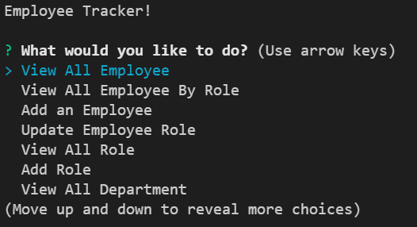

2. Then, you need to select one from the choices by pressing up or down arrow. Selecting "View All Employee" will display a table showing each employee in the "employee" database, with their first name and last name.

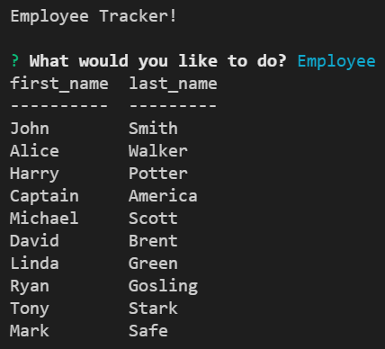

3. Selecting "view all department" will display the departments contained in the "department" database.

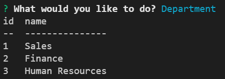

4. Selecting "view all employee by role" will display the employee with their roles.

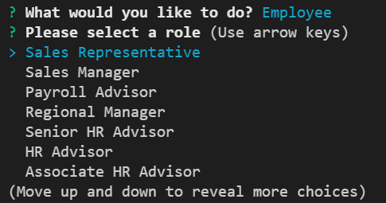

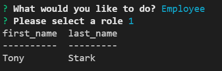

5. Similarly, selecting "View All Role" will display each title contained in the "roles" database, along with their associated salary and department id they have.

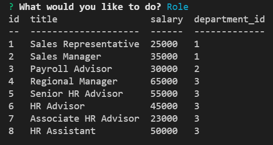

6. The user can add a new employee to the database by selecting "Add an employee." This will prompt the user for all the information necessary to add the new employee to the database.

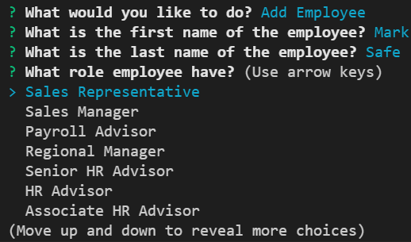

7. The user can add a new department to the database by selecting "Add Department".

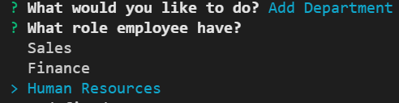

8. The user can add a new role to the database by selecting "Add role".

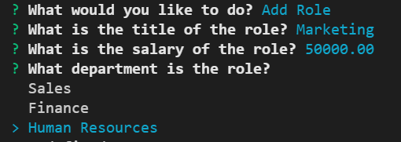

9. The user can update the employee role by clicking on "Update Employee Role"

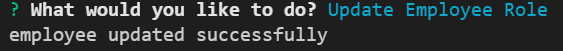

10. When everything is completed, user could click on the Exit button with a message "Connection to company_db database has been successfully closed.

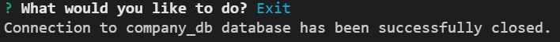

## Link to github

https://github.com/Etipriya/employee-tracker

## Link to the screencastify video

https://drive.google.com/file/d/1z8zjhVWF982ARHTyuZmPexau2MabVv8d/view?usp=sharing
